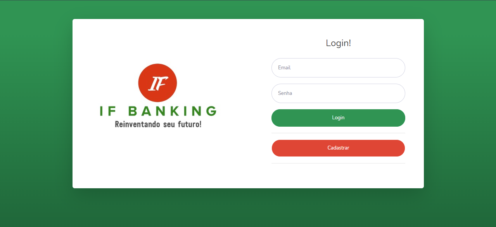
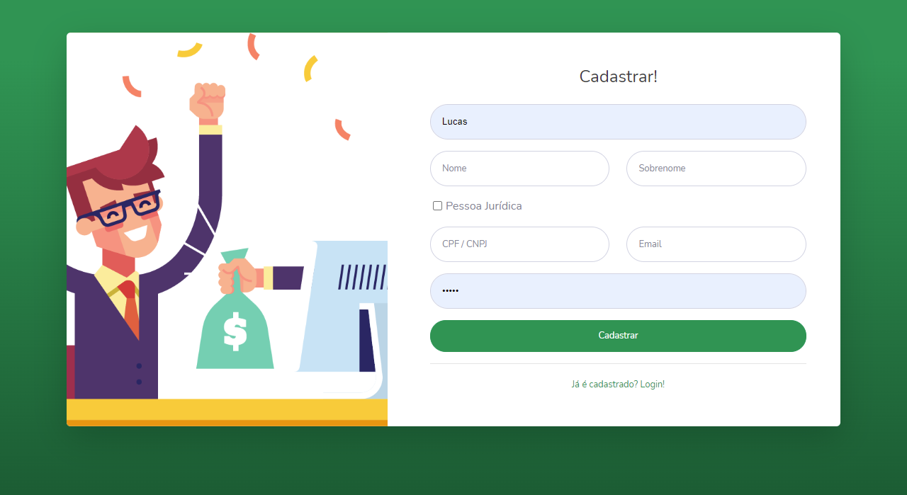
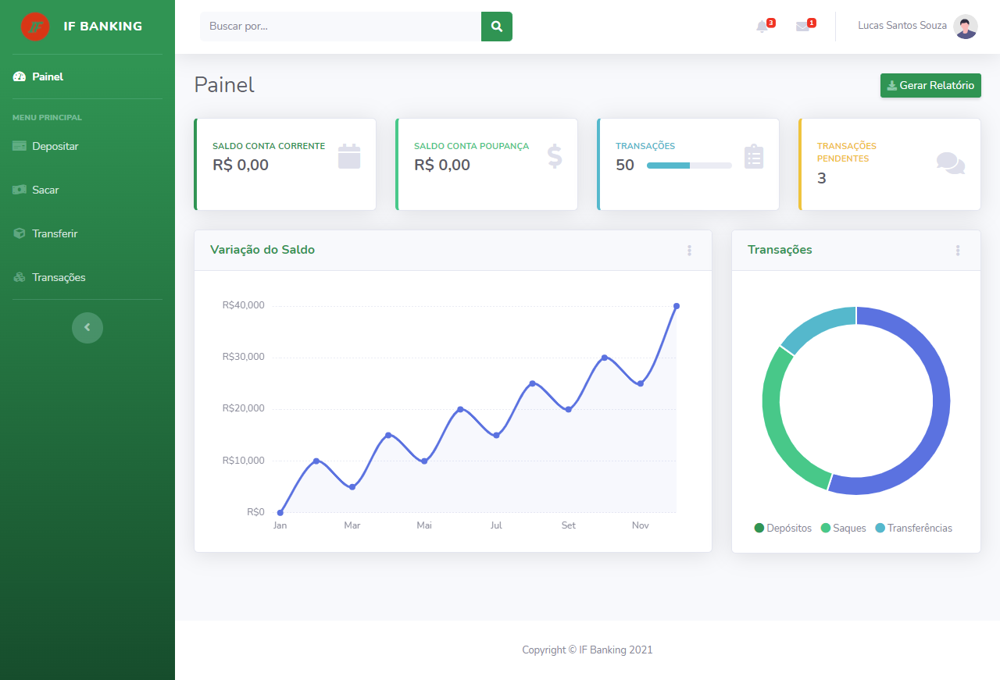
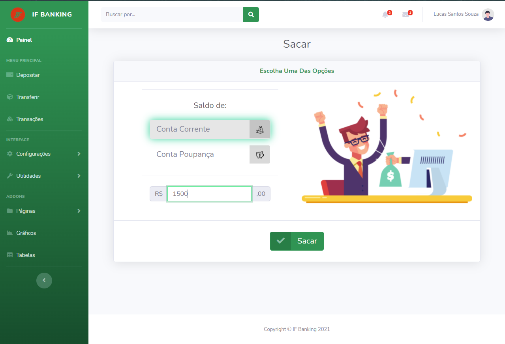
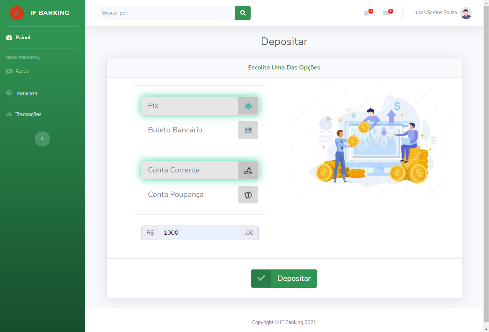
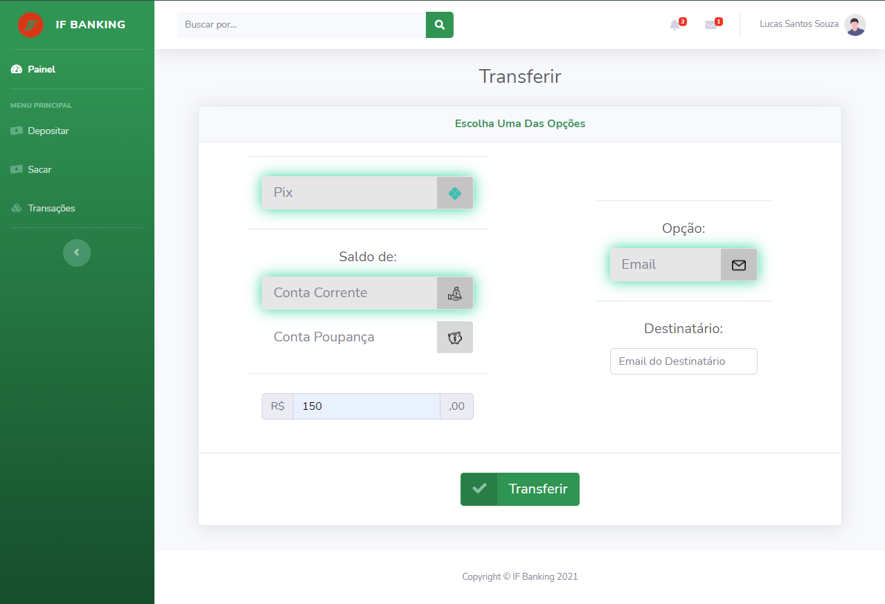
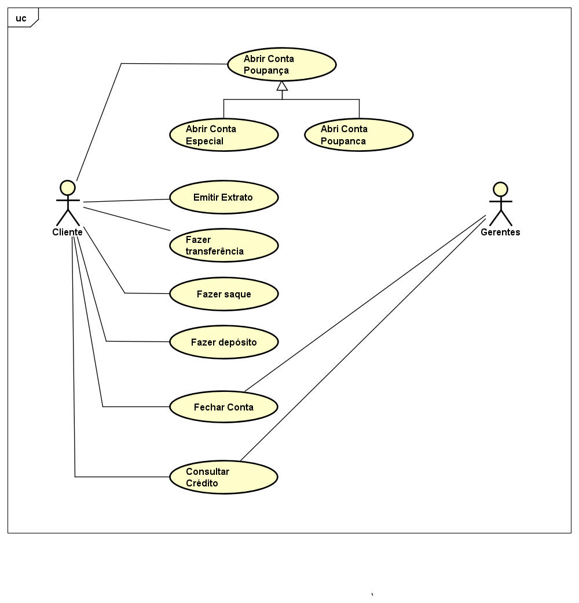
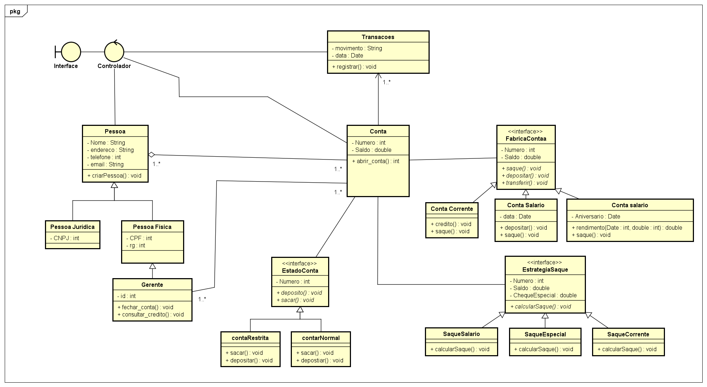
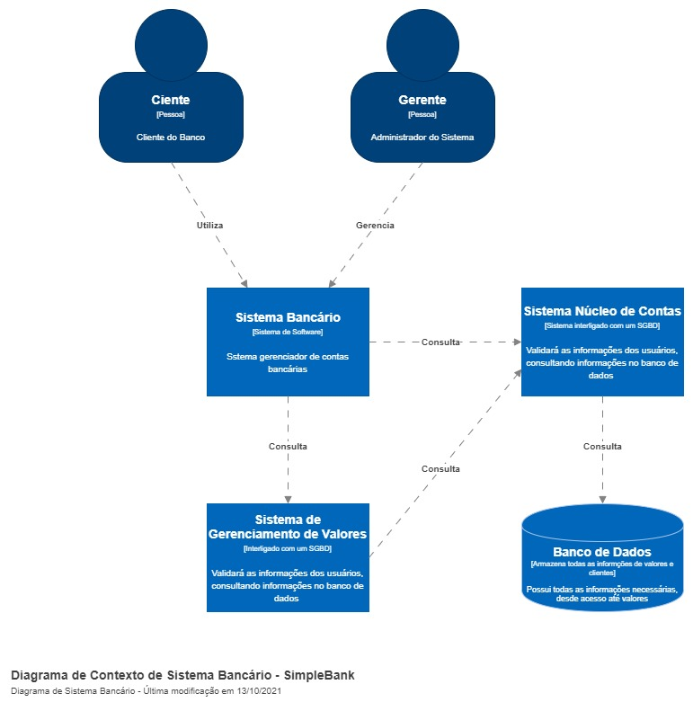

<h1 align="center">
    IF Bank
</h1>

  <a href="#-tecnologias">Tecnologias</a>&nbsp;&nbsp;&nbsp;|&nbsp;&nbsp;&nbsp;
  <a href="#-sobre">Sobre</a>&nbsp;&nbsp;&nbsp;|&nbsp;&nbsp;&nbsp;
  <a href="#-diagramas">Diagramas</a>&nbsp;&nbsp;&nbsp;|&nbsp;&nbsp;&nbsp;
  <a href="#-integrantes">Integrantes</a>

 

<!-- 

  

 -->

<h4 align="center">
   👷🏾‍♂️⚙️ Sistema em Desenvolvimento 👷🏾‍♂️
<h4>

## 🚀 Tecnologias

Tecnologias utilizadas:

- [VS Code](https://code.visualstudio.com/)
- [Eclipse](https://www.eclipse.org/)
- [Git](https://git-scm.com/)

## 💻 Sobre
Sistema bancário desenvolvido para o projeto interdisciplinar no 4º semestre do IFSP. O objetivo do nosso sistema é desenvolver uma interface bancária simples e intuitiva para os usuários. Dessa forma, eles poderão realizar saques, depósitos e transferências de forma rápida e fácil. 

 

<h2 align="center">
    Interface
</h2>
 
   
<ul>
  <li>
  O sistema possuirá área de cadastro e login.
   <ul>
      <li></li>
      <li></li>
    
   </ul>
  </li>
   
   
  <li>
  Haverá um painel principal interativo, contendo gráficos e informações relevantes.
  <ul>
      <li></li>
  </ul>
  </li>
   
   
  <li>
  Áreas destinadas aos saques, depósitos e transferêcias.
  <ul>
      <li></li>
      <li></li>
      <li></li>
  </ul>
  </li>
   
   
  <li>
  Aba de histórico de transações.
  <ul>
      <li></li>
  </ul>
  </li>
</ul>

 

<h3 align="center">
    Padrões de Arquiteturais
</h3>
<ul>
  <li>SOLID</li>
  <li>MVC</li>
  <li>DAO</li>
</ul>

 

<h3 align="center">
    Padrões de Projeto
</h3>
<ul>
  <li>Factory</li>
  <li>Strategy</li>
  <li>Observer</li>
</ul>

 
 

## 🗺️ Diagramas  
- Diagramas
  - Casos de Uso
     
  - Diagrama de Classes
     
  - Diagrama de Contexto
     
 

## 👨🏽‍🎓 Integrantes
<table>
<tr>
    <td>  
        Ronald Almeida
         
        
         
        Contate-me
        

            
              &nbsp;
            
              &nbsp;
            
              &nbsp;
            
         

    </td>
    <td>
        Lucas Santos Souza
         
         
         
        Contate-me
        

            
              &nbsp;
            
            </a>
              &nbsp;
            
         

    </td>
    <td>    
        Ivan Cardoso
         
         
         
        Contate-me
        

            
              &nbsp;
            
              &nbsp;
            
         

    </td>
</tr>
</table>
---

Faculdade - [Instituto Federal de Educação, Ciência e Tecnologia de São Paulo - IFSP Câmpus Campinas](https://portal.cmp.ifsp.edu.br/)
